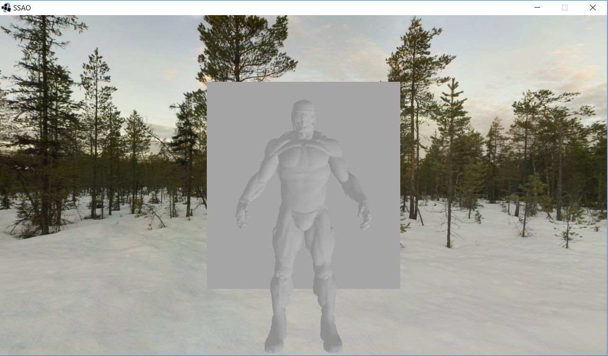
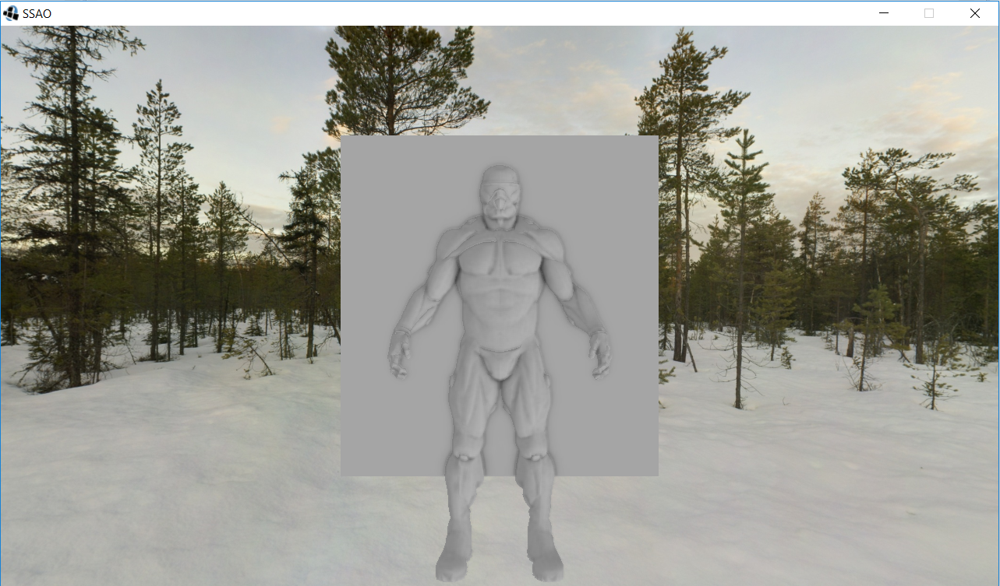
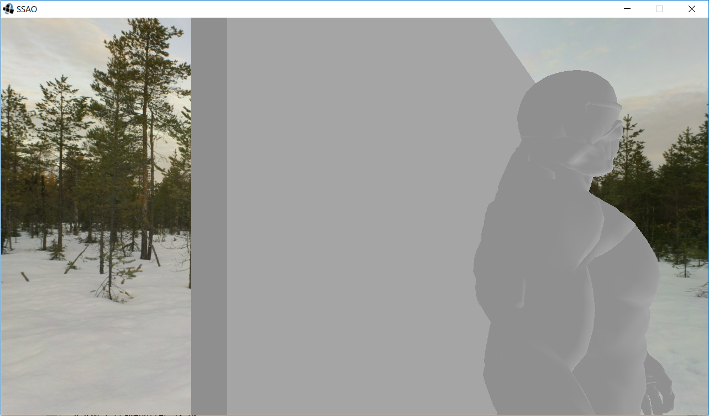
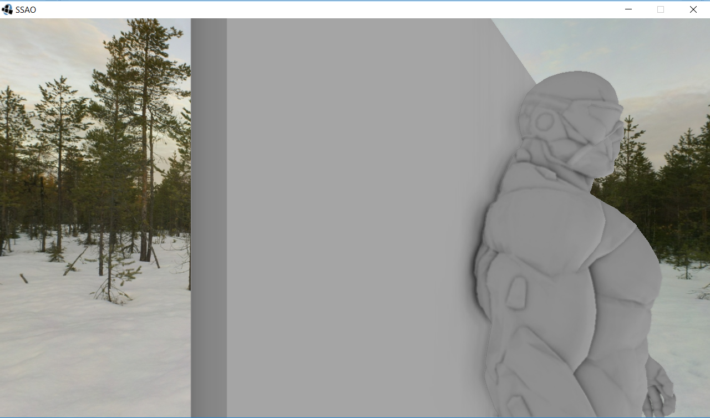
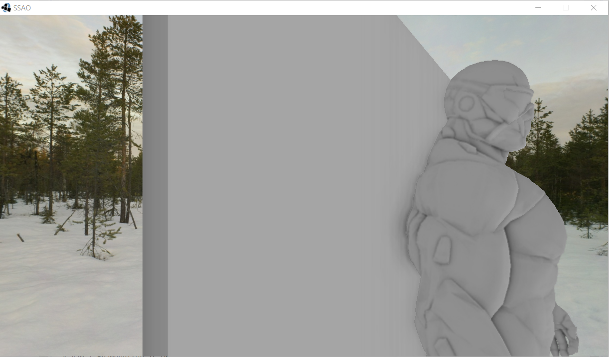

# Screen space ambient occlusion

Screen space ambient occlusion (SSAO) is a computer graphics technique for efficiently approximating the ambient occlusion effect in real time. It was developed by Vladimir Kajalin while working at Crytek and was used for the first time in 2007 by the video game Crysis, also developed by Crytek. While not an incredibly obvious effect, the image with SSAO enabled does feel a lot more realistic due to these small occlusion-like details, giving the entire scene a greater feel of depth.

## Implementation

Implementing this effect was done by using OpenGL for Java. In addition, the library rafgl was used, which is a library written by my teaching assistant at university. The purpose of rafgl is to make working with OpenGL in Java much easier. Furthermore, the classes GameCamera, GameObject and GameShader are classes I entirely took my teaching assistant as well, and their role is to handle the behaviour of the camera, model objects and the shaders.  

I used 5 shaders to achieve SSAO, and those are:
1. Geometry shader - The basic shader
2. SSAO shader - The actual shader where we produce the effect. The SSAO shader runs on a 2D screen-filled quad that calculates the occlusion value for each of the generated fragments (for use in the final lighting shader)
3. Blur shader - Since we are using noise to randomize the kernel for better quality and performance, we have to use blurring to remove the noise
4. Lighting shader - The shader that applies the occlusion factors to the lighting equatio. All we have to do is multiply the per-fragment ambient occlusion factor to the lighting's ambient component
5. Postprocessing shader- Shader that lets us turn the effect on or off

*This project was made possible largely t hanks to information in the following article: https://learnopengl.com/Advanced-Lighting/SSAO*

## Results

**SSAO Off:**

**SSAO On:**

**SSAO Shade Off:**

**SSAO Shade On (Close):**

**SSAO Shade On (Further away):**

## Usage

The program is started by running `Main.java`. The camera can be moved around using WASD and the arrow keys. The effect can be tweaked using QERT, QE will tweak the radius, RT will tweak the bias. The space key can be used to turn the effect on or off, to see the difference. Z and X will move the wall behind the model, demonstrating the range check part of the technique.
